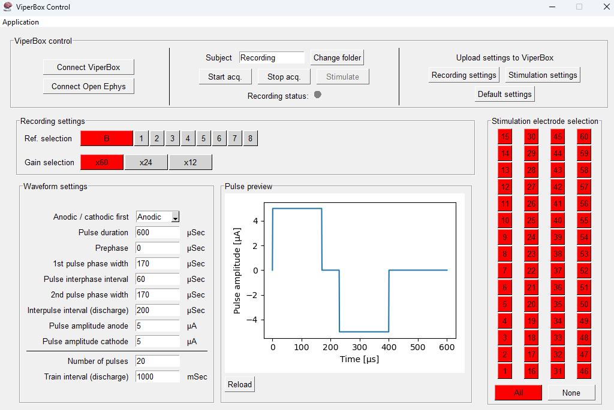
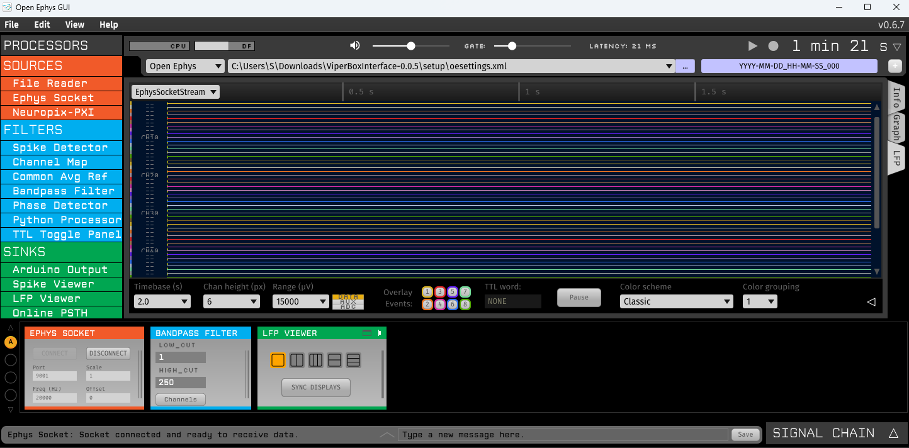
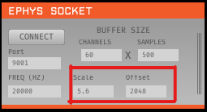
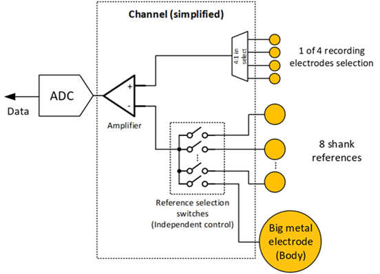
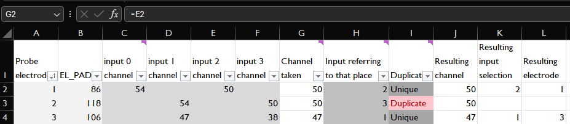
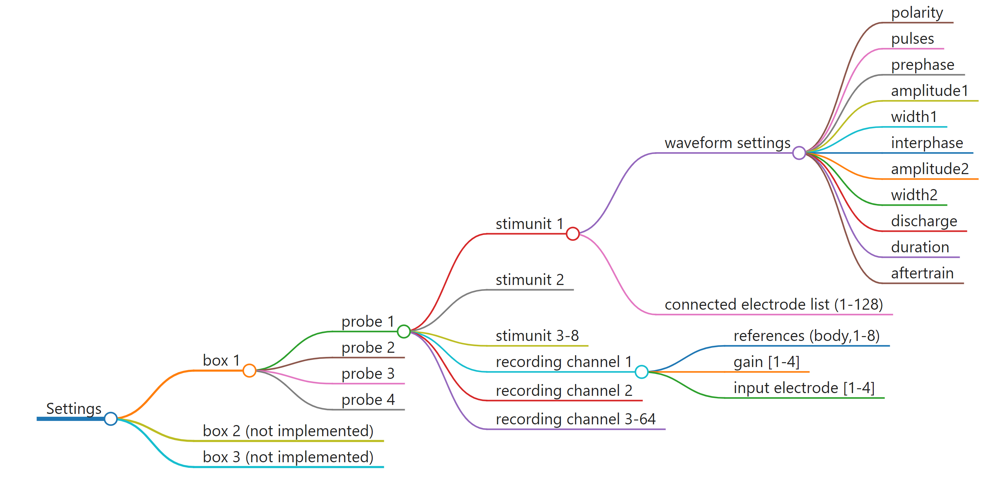
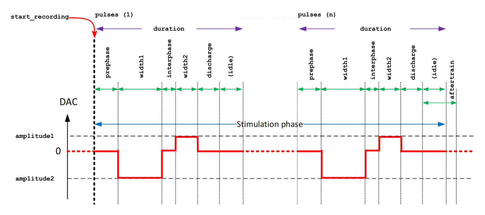

# :brain: ViperBoxInterface


> ViperBoxInterface is a piece of software that streamlines interaction with the ViperBox developed for the NeuraViPeR project.
> It streams data through [Open Ephys](#open-ephys).

<!-- toc-start -->

## :books: Table of Contents

<!-- START doctoc generated TOC please keep comment here to allow auto update -->
<!-- DON'T EDIT THIS SECTION, INSTEAD RE-RUN doctoc TO UPDATE -->

- [:desktop_computer: Using the GUI](#desktop_computer-using-the-gui)
  - [Starting up](#starting-up)
    - [ViperBox Control usage](#viperbox-control-usage)
    - [Open Ephys GUI usage](#open-ephys-gui-usage)
  - [Recording](#recording)
- [:gear: Settings](#gear-settings)
  - [Gain settings](#gain-settings)
  - [References and input settings](#references-and-input-settings)
  - [Choosing probe electrodes](#choosing-probe-electrodes)
- [:question: (F)AQ](#question-faq)
- [:robot: Using the API](#robot-using-the-api)
- [:hammer_and_wrench: Overview of ViperBox settings](#hammer_and_wrench-overview-of-viperbox-settings)
- [:memo: Changing settings through XML scripts](#memo-changing-settings-through-xml-scripts)
  - [RecordingSettings](#recordingsettings)
  - [Stimulation settings](#stimulation-settings)

<!-- END doctoc generated TOC please keep comment here to allow auto update -->

<!-- toc-end -->

You need to create a conda environment named 'viperbox' and install the packages in setup/environment.yaml. You can do this by running `conda create --name viperbox --file [path-to-viperboxinterface-folder]/setup/viperbox.yaml`.
 No startup shortcut will be created.

## :desktop_computer: Using the GUI

The GUI can be used to control the ViperBox directly.

### Starting up

The installation script creates a shortcut on the desktop called "ViperBoxAPI". Three screens will be opened; the ViperBox Control, the Open Ephys GUI and a terminal. If this didn't work out for some reason, you can also start the software by navigating to the folder where the software is downloaded and double-click start_app.bat.

If that doesn't work (see [FAQ](#faq)), you can start the software by following these steps (also make sure you have the latest version of the software):

1. Open Anaconda Prompt (you can find it by searching for it in the start menu)
2. Type `conda activate viperbox` and press enter
3. Navigate to the folder where the software is downloaded by typing `cd <path to the folder>`
4. Type `uvicorn main:app --reload` and press enter





#### ViperBox Control usage

In *ViperBox control*, you can

- Connect to the ViperBox and connect to Open Ephys. This happens automatically when you start the software.
- Change recording file name and location and start and stop the acquisition. You'll see the recorded data in the Open Ephys GUI. You can also stimulate if you are recording.
- Upload settings to the ViperBox. You can either upload the recording or stimulation settings you set in the GUI or you can upload default settings. The default settings are located in the `defaults` folder. You can edit these to your liking.

In *Recording settings*, you can change the recording settings. In the IMTEK probes and the short wired MZIPA, only the body [reference](#references-and-input-settings) is connected to the ASIC. To use the correct gain, please refer to [Gain settings](#gain-settings). To change from which electrode you want to record, refer to [Choosing probe electrodes](#choosing-probe-electrodes).

In *Waveform settings*, you can change the stimulation waveform.

In *Pulse preview*, you can preview the stimulation waveform after you press `Reload`.

In *Stimulation electrode selection*, you can select from which electrodes you want to stimulate.

#### Open Ephys GUI usage

The Open Ephys GUI is an open-source, plugin-based application for acquiring extracellular electrophysiology data. It was designed by neuroscientists to make their experiments more flexible and enjoyable. The full documentation can be found [here](https://open-ephys.github.io/gui-docs/User-Manual/Exploring-the-user-interface.html).

### Recording

Recording can be done in the top of he Open Ephys interface.


Data can be saved in binary, Open Ephys Format and NWB format. The Open Ephys Format useful for loading the data into NeuroExplorer from which it can then be exported into .NEX or .NEX5 format. The formats are not available out of the box, to install them, please [follow the instructions](https://open-ephys.github.io/gui-docs/User-Manual/Recording-data/index.html).

## :gear: Settings

### Gain settings

> [!WARNING]
> To correctly view the voltage levels in Open Ephys, the following scaling and offset numbers need to be supplied to the Ephys Socket in Open ephys:

| Gain | Scale | Offset |
| ---- | ----- | ------ |
| 60   | 5.6   | 2048   |
| 24   | 11.2  | 2048   |
| 12   | 19.8  | 2048   |



To change these settings, first you need to stop the acquistion of data in Open Ephys by clicking the yellow play button in the top right of the screen. Then you can click 'DISCONNECT' in the Ephys Socket module. After that, you can change the values in the 'Scale' field. After changing the values, go to the ViperBox interface and click 'Connect Open Ephys', then click 'CONNECT' in the Ephys Socket module.

### References and input settings

Reference settings are wired in the chip in the following way. For each of the 64 channels (or amplifiers), one electrode can be chosen from a set of 4 electrodes. This set is hardwired and cannot be changed.

This signal is compared to any or all of the references (which you can select in the GUI). In principle, the body reference should always be used.



### Choosing probe electrodes

With the IMTEK probe and the short wired MZIPA, it is not possible to record from all the 60 electrodes at the same time. However, it is possible to select from which electrode you want to record.

To change from which of the 4 electrodes you want to record (as mentioned in [References and input settings](#references-and-input-settings)), edit the Excel file in the `defaults` folder, called `electrode_mapping_short_cables.xlsx`.

This mapping is specifically designed for the 4 shank IMTEK probe. The first column is the electrode on the IMTEK probe. You can choose the value in the 'Channel taken' column, it has to be set equal to a value in one of the 'input # channel' columns.

For example, you want Probe electrode 1 to be connected to channel 50, then in 'Channel taken', you change the value to `=E2`. This will update the sheet and but you will see that Probe electrode 2 now has 'Duplicate' in the 'Duplicate' column. This means that it won't be possible to record from Probe electrode 2 and the recording will be set to 0.

Only edit the 'Channel taken' column. Whenever the software starts or new settings are uploaded to the ViperBox, the Excel file will be read and the settings will be updated.

Note that in the resulting recording in Open Ephys, the 'Duplicate' channels will be set to an empty signal but their order is the same as on the IMTEK probe.



## :question: (F)AQ

- **Q**: Open Ephys doesn't show any data, what can I do?
    - **A**: In the bottom left, click the connect button in the signal chain in the Ephys Socket module. After that, click the play button in the top right of the Open Ephys window.
- **Q**: The shortcut is not working, what can I do?
    - **A**: This is probably due to the fact that PowerShell doesn't have rights as to execute the startup script, in particular, the `conda` command. There is a whole StackOverflow thread about this [here](https://stackoverflow.com/questions/64149680/how-can-i-activate-a-conda-environment-from-powershell). Probably the following might help:

        1. Open PowerShell and browse to `condabin` folder in your Conda installation directory, for example: `C:\Users\<username>\anaconda3\condabin`
        2. Run `./conda init powershell` in that folder, and reopen the PowerShell.
        3. Please note: If you encountered `ps1 cannot be loaded because running scripts is disabled on this system`, simply run the PowerShell as Administrator and enter the following: `Set-ExecutionPolicy -Scope CurrentUser -ExecutionPolicy Unrestricted`
        4. Try again to start the software by double-clicking the shortcut on the desktop.

- **Q**: The software is not responding, what can I do?
    - **A**: Often, the best solution is to close all running instances of the software and hardware. This means pressing the power button on the ViperBox to shut it down and closing the software. If the software is stuck, you can got to Windows Task Manager and find a process called 'Python' and end it. Then, restart the software and the ViperBox.
    - Note: if you are running some other Python software, you won't be able to discern between the two. Don't stop a process if this can cause problems.
- **Q**: What do the colors of the LED's on the ViperBox mean?
    - **A**: The LED's on the ViperBox have the following meanings:
        - ViperBox power button side
            - Green: the ViperBox is connected to the computer
            - Red: the ViperBox is not connected to the software or there is an error
            - Blue: the ViperBox is recording
        - ViperBox SerDes side
            - White: headstage connected or emulation active
            - off: otherwise


## :robot: Using the API

The API can be used to communicate with the ViperBox. It can be used to connect to the ViperBox, upload recording and stimulation settings and start and stop recordings and stimulations.
The API can be manually controlled from the web interface by clicking the dropdown next to the function, then clicking "Try it out" and then clicking the blue "Execute" button.
The typical workflow to do a recording and stimulation is to run the following commands:
- `/connect`: to connect to the ViperBox


- `/upload_recording_settings`: to upload the recording settings. Default [XML settings](#xml-scripts) are selected by default.
  - To edit the settings, open an editor and copy the default settings from the defaults folder into it. Adjust them and copy and paste everything into the ViperBox API. See below.


- `/upload_stimulation_settings`: to upload the stimulation settings. Default settings are selected by default. XML settings can be added here, too.
- `/start_recording`: to start the recording. Don't forget to give up a name.
- `/start_stimulation`: to start the stimulation.
- `/stop_recording`: to stop the recording. The recording will be saved in the Recordings folder. The settings that you used to record will be saved in the Settings folder under the same name but as XML file.

During a recording, new stimulation settings can be uploaded and a new stimulation can be started.

> [!WARNING]
> **Before version 0.0.4**, there is a problem with the driver that is necessary to connect to the ViperBox. An incompatible driver is installed automatically overnight. Every time you start the ViperBoxInterface, you need to reinstall the driver. This can be done by following these steps:

> 1.	Connect ViperBox to PC and power on
> 2.	Navigate to setup/DowngradeFTDI, and run the downgrade.bat batch file
> 3.	Power cycle ViperBox
> 4.	Optionally: verify driver version in Device Manager

## :hammer_and_wrench: Overview of ViperBox settings



- box: there are up to 3 boxes
- probes: each box can have up to 4 probes connected to them
- stimunit waveform settings: define the waveform that the stimunit generates
- stimunit connected electrodes: each stimunit can be connected to any or all of the 128 electrodes.
- recording channels: each box has 64 recording channels that each have several settings

## :memo: Changing settings through XML scripts

The way to communicate settings with the ViperBox is through XML scripts. These scripts can be used to define settings and to start and stop recording and stimulation. The XML scripts can be sent to the ViperBox through the API.

### RecordingSettings

Here is an example for setting the recording settings in XML format. The default recording settings are the following:
```xml
<?xml version="1.0" encoding="UTF-8"?>
<Program>
    <Settings>
        <RecordingSettings>
            <Channel box="-" probe="-" channel="-" references="-" gain="1" input="0"/>
        </RecordingSettings>
    </Settings>
</Program>
```

In the above code, the default recording settings are stored in the `Channel` element. The first part defines for which component the settings are meant, the second part describes the settings.

- `box="-"` means for all boxes that are connected.
- `probe="-"` means for all probes that are connected.
- `channel="-"` means for all recording channels (always 64).
- `references="-"` means all [reference](#references-and-input-settings), this means the Body reference and references 1-8.
- `gain="1"` means the channel [gain](#gain-settings). The possible values are:
    - "0": x 60
    - "1": x 24
    - "2": x 12
- `input="0"` means which [input](#choosing-probe-electrodes) electrode should be connected to the recording channel.

You can also specify the settings more precisely. For example, if you want recording channels 1, 6, 7 and 8 to have fewer references, namely only reference 'b' (body) and '3':

```xml
<?xml version="1.0" encoding="UTF-8"?>
<Program>
    <Settings>
        <RecordingSettings>
            <Channel box="-" probe="-" channel="-" references="-" gain="1" input="0"/>
            <Channel box="-" probe="-" channel="1,6-8" references="b,3" gain="1" input="0"/>
        </RecordingSettings>
    </Settings>
</Program>
```

In the above case, the first line will be loaded to the ViperBox first and then the latter channel settings will be overwritten to the specific channels.

### Stimulation settings

The default stimulation settings are the following:
```xml
<?xml version="1.0" encoding="UTF-8"?>
<Program>
    <Settings>
        <StimulationWaveformSettings>
            <Configuration box="-" probe="-" stimunit="-" polarity="0" pulses="20" prephase="0"
                amplitude1="5" width1="170" interphase="60" amplitude2="5" width2="170"
                discharge="200" duration="600" aftertrain="1000" />
        </StimulationWaveformSettings>
        <StimulationMappingSettings>
            <Mapping box="-" probe="-" stimunit="-" electrodes="-" />
        </StimulationMappingSettings>
    </Settings>
</Program>
```

In StimulationWaveformSettings, `stimunit` means stimulation unit which is a waveform generator, there are 8 stimulation units per probe.
In StimulationMappingSettings, these stimulation units can be connected to any or all of the electrodes.



The possible parameters for the stimulation units are:

| Setting      | Description                                              | Unit    | Range     | Step size | Default |
| ------------ | -------------------------------------------------------- | ------- | --------- | --------- | ------- |
| `polarity`   | Polarity of the stimulation waveform                     | boolean | 0-1       | 1         | 0       |
| `pulses`     | Number of pulses in the waveform                         | number  | 1-255     | 1         | 20      |
| `prephase`   | Time in microseconds before the first pulse              | μs      | 100-25500 | 100       | 0       |
| `amplitude1` | Amplitude of the first phase                             | μA      | 0-255     | 1         | 5       |
| `width1`     | Width of the first phase                                 | μs      | 10-2550   | 10        | 170     |
| `interphase` | Time between the first and second phase                  | μs      | 10-25500  | 10        | 60      |
| `amplitude2` | Amplitude of the second phase                            | μA      | 0-255     | 1         | 5       |
| `width2`     | Width of the second phase                                | μs      | 10-2550   | 10        | 170     |
| `discharge`  | Time in microseconds after the last pulse                | μs      | 100-25500 | 100       | 200     |
| `duration`   | Duration of the entire train                             | μs      | 100-25500 | 100       | 600     |
| `aftertrain` | Time in microseconds after the entire train has finished | μs      | 100-25500 | 100       | 1000    |

<!-- ## XML control scripts
XML scripts can have full or partial control over the ViperBox. They can be used for:
- defining settings
- starting and stopping recording and stimulation

The format is as follows:
```xml
<Program>
    <Settings>
        <RecordingSettings>
            <Channel box="-" probe="-" channel="-" references="100000000" gain="1" input="0" />
        </RecordingSettings>
        <StimulationWaveformSettings>
            <Configuration box="-" probe="-" stimunit="-" polarity="0" pulses="20"
                prephase="0" amplitude1="1" width1="170" interphase="60" amplitude2="1" width2="170"
                discharge="200" duration="600" aftertrain="1000" />
        </StimulationWaveformSettings>
        <StimulationMappingSettings>
            <Mapping box="-" probe="-" stimunit="-" electrodes="-" />
        </StimulationMappingSettings>
    </Settings>
</Program>
```

As can be seen from the sample, at the highest level there is the program element. Below that there are settings or instructions. In settings there are RecordingSettings, StimulationWaveformSettings and StimulationMapping settings. -->
